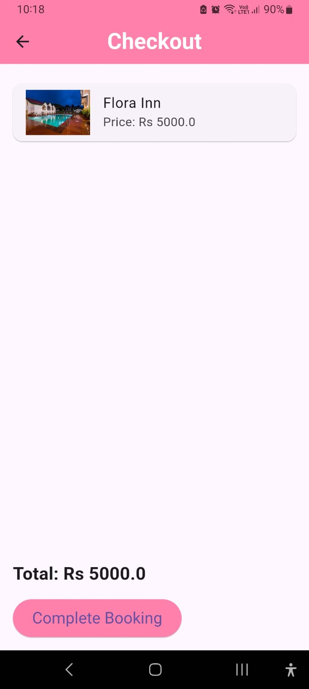

# Rest Quest 
An Airbnb-like mobile application built using Flutter boilerplate for seamless booking and property management.
1) Integrated a custom splash screen for an enhanced user experience during app launch.
2) Added a dynamic search bar for quick and easy property searches.
3) Implemented check-in/check-out date selection with a calendar view and a user-friendly bar for selecting the number of guests.
   
   

    
    
    
     

4) Enabled navigation to detailed accommodation information upon tapping on an accommodation listing.
   
     

    
    
    

5) Fixed bugs in the 'showDeletedConfirmationDialog' and 'AccountDeletedAction' for improved stability and user experience.
6) Enhanced image handling by incorporating a placeholder image or loading indicator during image fetching for smoother user experience.
7) Implemented Google OAuth for secure and convenient user authentication.
8) Added SnackBar notifications to confirm when a user adds a stay to the wishlist or completes checkout.
9) Corrected Cross-Origin Resource Sharing (CORS) issues in Firebase Storage to ensure proper functionality across different domains.

    

    
    
    

# Name: Arshia Rajesh Yadav
# College: K.J Somaiya College Of Engineering
# Roll No: 16010321013
# Email: arshia.yadav@somaiya.edu 
# Phone no: 9819975349
