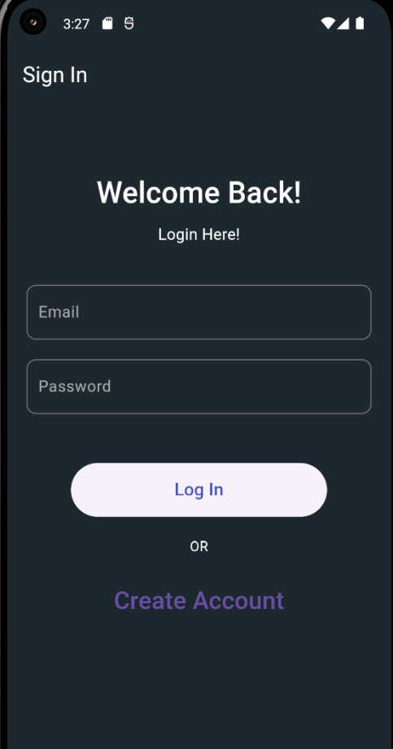
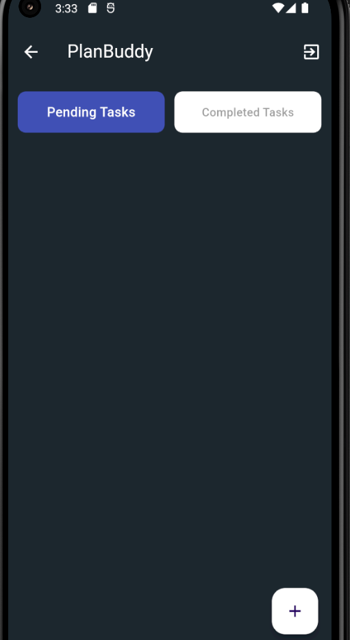

# PlanBuddy - ShreKhan Project

Welcome to the Flutter Todo Task App - PlanBuddy

PlanBuddy is a productivity app designed to help users manage and organize their tasks effectively. It features a clean and intuitive interface where users can view and categorize tasks into "Pending" and "Completed" sections. Users can add new tasks, edit existing ones, and easily switch between different task views using a simple tab interface. The app integrates with Firebase for user authentication and data storage, ensuring seamless synchronization and security. 
The main functionalities include:
1) Task Management: Add, edit, and categorize tasks as pending or completed.
2) User Authentication: Sign in and sign out securely using Firebase Authentication.
3) Real-time Data Sync: Store and manage tasks in real-time with Firebase Firestore.
4) PlanBuddy aims to streamline task management and enhance productivity with a user-friendly experience.

==============================================

# Steps

1) . Add the Android Folder
If your existing Flutter project doesn’t have the Android folder, you can generate it with the following command:

 * Navigate to Your Project Directory:
            `cd path/to/your/project`
 * Generate the Android Folder:
            `flutter create` .
This command will create the necessary Android folder and  its configuration files if they are missing.

2) Firebase Setup
Add Firebase to Your Flutter App:
  1. Go to the “Project settings” in the Firebase Console.
  2. Under “Your apps,” select the appropriate platform (iOS/Android) and follow the instructions to register your app.
   3. Download the google-services.json (for Android) or GoogleService-Info.plist (for iOS) and place them in the respective directories:
      * For Android: Place google-services.json in the android/app directory.
      * For iOS: Place GoogleService-Info.plist in the ios/Runner directory.
3) Configure Firebase for Flutter:
    * Run the following command to generate firebase_options.dart:
      `flutterfire configure`
This will create the firebase_options.dart file in your project. Ensure it is properly imported and used in your main.dart file.

4) Update Firebase SDK Dependencies:

     * Ensure you have the correct Firebase dependencies in your pubspec.yaml file. Add or update the dependencies as needed:
     ` dependencies:`
         `firebase_core: ^3.4.0`
         `firebase_auth: ^5.2.0`
         `cloud_firestore: ^5.3.0`
         `provider: ^6.1.2`
         `intl: ^0.19.0`
         `flutter_slidable: ^3.1.1`
         `flutter_spinkit: ^5.2.1`
         `get_storage: ^2.1.1`
5) Run the App
  1. Ensure Firebase Setup:
      * Make sure all Firebase configurations are correctly set up, and dependencies are installed.
  2. Run the App:
      * Use the following command to run the app on your emulator or physical device:
           `flutter run`
         
# Using the App 

Sign In: Use the authentication options provided to sign in or create a new user account.
Manage Tasks: Add, edit, and view tasks in the “Pending” and “Completed” sections.
Sign Out: Use the sign-out button in the app to log out of your account.
    

# Key Features 
1) User Authentication:
    * Secure Sign-In/Sign-Out: Manage user accounts securely with Firebase Authentication.
    * Sign-In Requirements:
          + Email and Password: Users must provide a valid email address and a password that meets minimum complexity requirements (e.g., at least 6 characters).
    *    Display Messages: Inform users of any sign-in issues with clear error messages if fields are missing or if the password does not meet requirements.

      

2) Task Management:
  * Create Tasks: Add new tasks with details and due dates(+ icon for adding task).
    
  * Edit Tasks: Modify existing tasks with updated information.
     
  * Delete Tasks: Remove tasks with a swipe gesture.

3) Task Interaction:
   * Swipe Actions:
     + Left Swipe: Reveal options to delete or edit tasks.
     + Right Swipe: Mark tasks as completed.
     
   * Completion Handling:
     + Move to Completed Tab: Tasks marked as completed are automatically moved to the "Completed" tab.
     + Strike-Through Effect: Completed tasks are displayed with a strike-through to visually indicate completion.
       

4) Real-Time Data Sync:
   *  Firestore Integration: Sync and manage tasks in real-time using Firebase Firestore. 
     
5) Responsive Design:
   * Cross-Platform Compatibility: Ensure the app works well on phones, tablets, and desktops with adaptive layouts.
6) User Interaction Enhancements:
   * Navigation: Easy navigation through tab-based views for pending and completed tasks.
   * Floating Action Button (FAB): Add new tasks quickly using the FAB with an add icon.

